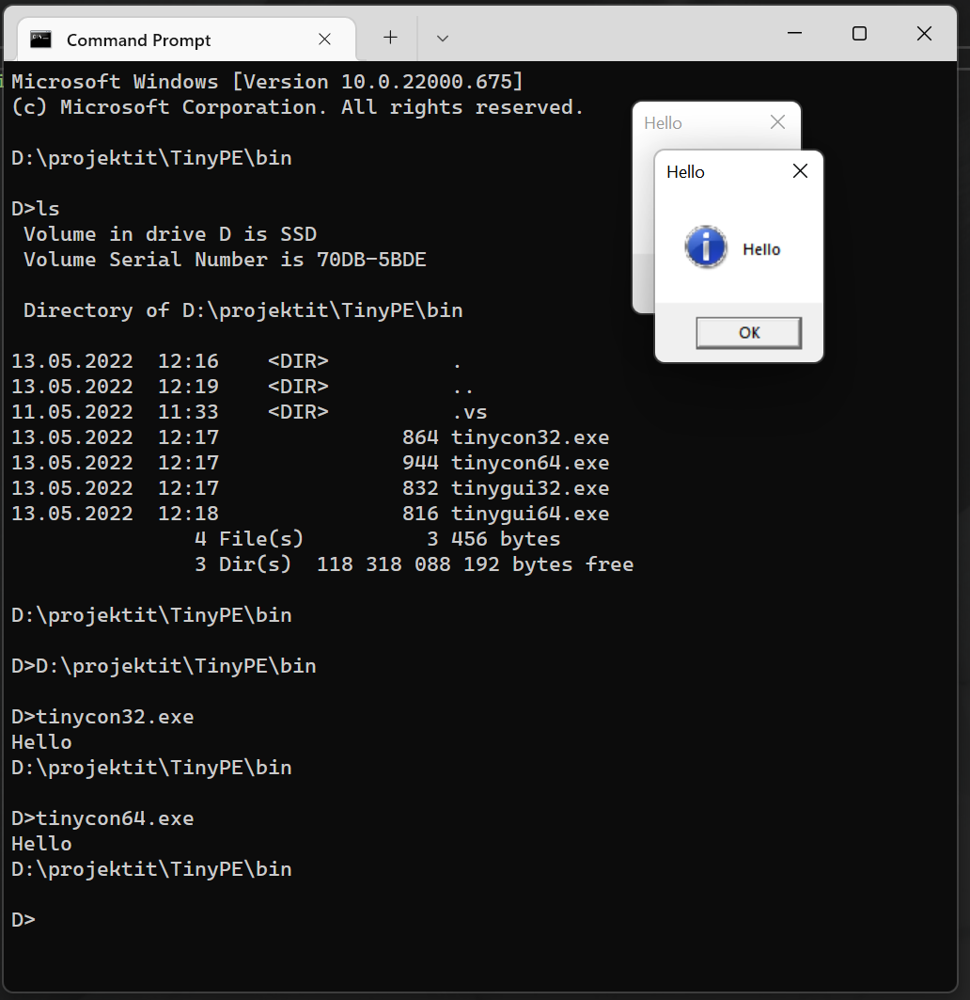

# TinyPE
POC Tiny PE - CMake and VS2022 (open as local folder)
  - uses undocumented linker flags: */emittoolversioninfo:no /emitpogophaseinfo*

| Hello World    | Console    | Gui       |
|----------------|------------|-----------|
| 64-bit         | 672 bytes  | 592 bytes |
| 32-bit         | 592 bytes  | 560 bytes |

| Empty program     | Console    | Gui       |
|-------------------|------------|-----------|
| 64-bit            | 416 bytes  | 416 bytes |
| 32-bit            | 400 bytes  | 400 bytes |

Tested on Windows 11 21H2 (22000.258 - 22000.1817)

